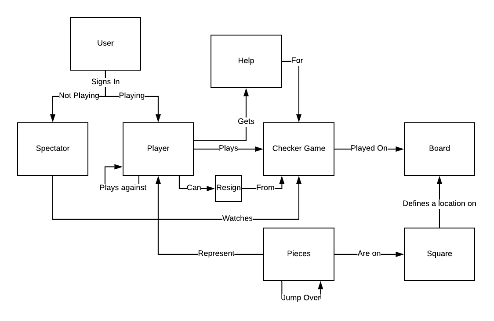
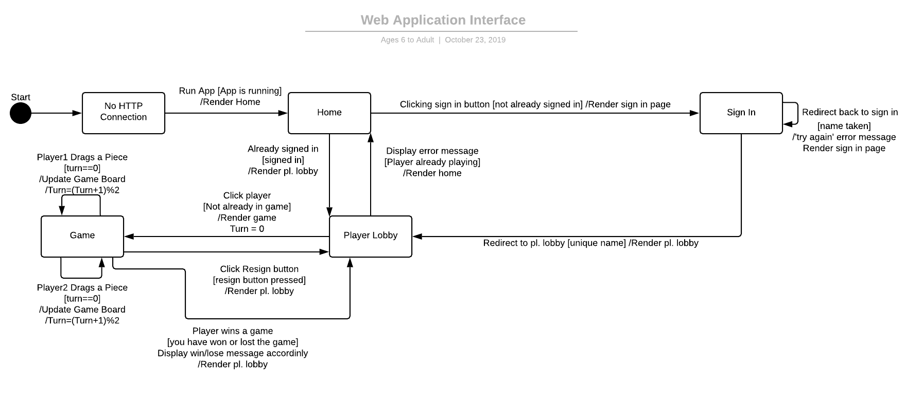

# PROJECT Design Documentation

> _The following template provides the headings for your Design
> Documentation.  As you edit each section make sure you remove these
> commentary 'blockquotes'; the lines that start with a > character
> and appear in the generated PDF in italics._

## Team Information
* Team name: 2191-swen-261-05-b-ages6toadult
* Team members
  * Jordan Bailey
  * Daniel Cho
  * Lacey Dallum
  * Chris Murphy
  * Joey Trumbull

## Executive Summary

This is a summary of the project.

### Purpose

This project is WebCheckers. I guess I have to explain that this is a checkers
game played on the web (hence the name, WebCheckers).

As such, the goal of this project is to allow two players to be able to play
a game of checkers on the web (astonishing, right). Of course, it can't be
that simple because it's a school project. More specifically, this
project must allow multiple players to connect to a player Lobby and have
the choice to start and play a game. And all of this must look somewhat well
(or at least not the worst) with regard to the HTML and Spark API integration.

Of course the only user group that we care about are the project managers,
Professor Lange and Jefferey. For this user goal, we must finish our
MVP and not have it crash horribly during our presentations. Thus, we must
have the Player Lobby, the games, and the total functionality included.

Another (important?) user group is the users who will be playing and probably
trying to break our application (the horrors of SWEN test monkeys aka first
years). For this group of users, not only must we include the MVP, but we
must error check a lot to prevent them from finding a way to crash our program
(this includes unit tests and rigorous testing). After all, SWEN majors tend
to break everything they touch.

### Glossary and Acronyms

| Term | Definition |
|------|------------|
| VO | Value Object |
| VM | View Model   |
| MVP| Minimum      |
|    | viable       |
|    | product      |

## Requirements

This section describes the features of the application.

> _In this section you do not need to be exhaustive and list every
> story.  Focus on top-level features from the Vision document and
> maybe Epics and critical Stories._

### Definition of MVP
> _Provide a simple description of the Minimum Viable Product._

### MVP Features
> _Provide a list of top-level Epics and/or Stories of the MVP._

### Roadmap of Enhancements
> _Provide a list of top-level features in the order you plan to consider them._

## Application Domain

This section describes the application domain.

For the WebCheckers domain, the most central entity is the Checkers game.
This is played by users and consists of moves. These users can either be players, who are
the two people that are actually playing the game, or spectators, which is a person who is
just watching the game and is an enhancement to the MVP. These players use pieces to play the checkers game.
The pieces can either be a single piece which represents a regular piece that can only advance or can be a
double piece which represents a king with both advance and retreat capabilities. These pieces are located on
a board made of 8x8 spaces. These are alternating red/black in a checkerboard pattern (hence checkers). However,
the pieces can only be placed on the black spaces. At any point, a player can get help. This is another enhancement
that provides the best possible move for the player.

## Architecture and Design

This section describes the application architecture.

### Summary

The following Tiers/Layers model shows a high-level view of the webapp's architecture.

As a web application, the user interacts with the system using a
browser.  The client-side of the UI is composed of HTML pages with
some minimal CSS for styling the page.  There is also some JavaScript
that has been provided to the team by the architect.

The server-side tiers include the UI Tier that is composed of UI Controllers and Views.
Controllers are built using the Spark framework and View are built using the FreeMarker framework.  The Application and Model tiers are built using plain-old Java objects (POJOs).

Details of the components within these tiers are supplied below.

### Overview of User Interface

This section describes the web interface flow; this is how the user views and interacts
with the WebCheckers application.

Imagine Garrie, the Checkers Master (thank you Martinez), is a user of the product. Being a Checkers Master, he
decides that he wants to get better at checkers by playing online.

Garrie starts with no http connection. But, being the tech wizard that he is, he opens the application and
initiates an http connection. From here, the states diverge. It could go straight into the PlayerLobby if he had
already been logged in prior to initiating the connection. But because he's a n00b, he hasn't logged into the
application before and has to sign into a new account.

Garrie puts in his desired username: XxXx__GetRektM9__xXxX. Being the classic username that it is, though, it is taken.
Therefore, an error displays telling him to choose a new name. He does so altering his name to
XxXx__MLGPRO360NoScope__xXxX. As it is not taken, he is admitted into the PlayerLobby.

Now that he is in the PlayerLobby, he is ready to exact revenge on his arch-nemesis, Larrie the Chess Master
(I'm really bad at names). He clicks on Larrie's username: xXL0Rd0fSw4gXx. This forces Larrie into a game.
He doesn't have a choice.

Now that they are in-game, the players are able to move pieces. Yet, when Larrie tries to take advantage of his
opponents' hesitance by trying to move first, it fails and gives him an error. That's not how this works Garrie.
It's not your turn. Larrie takes his turn and advances one of his pieces. Now it is Garrie's turn and he can move.
He also advances his piece. At this point in the riveting story, Larrie confidently moves again.

At this point, the states could diverge. Now imagine that Garrie is startled by the brilliance of one of Larrie's moves.
As a result, he clicks the resignation button and dishonors his family by giving up. This will bring both players back
to the PlayerLobby with messages reporting the status of the game (win/loss).

Now imagine that Garrie somehow manages to jump every single piece in a single turn winning the game (as he is a
checkers master after all). This will result in the game ending and it also sending both players back
to the PlayerLobby with messages reporting the status of the game.

### UI Tier
> _Provide a summary of the Server-side UI tier of your architecture.
> Describe the types of components in the tier and describe their
> responsibilities.  This should be a narrative description, i.e. it has
> a flow or "story line" that the reader can follow._

> _At appropriate places as part of this narrative provide one or more
> static models (UML class structure or object diagrams) with some
> details such as critical attributes and methods._

> _You must also provide any dynamic models, such as statechart and
> sequence diagrams, as is relevant to a particular aspect of the design
> that you are describing.  For example, in WebCheckers you might create
> a sequence diagram of the `POST /validateMove` HTTP request processing
> or you might show a statechart diagram if the Game component uses a
> state machine to manage the game._

> _If a dynamic model, such as a statechart describes a feature that is
> not mostly in this tier and cuts across multiple tiers, you can
> consider placing the narrative description of that feature in a
> separate section for describing significant features. Place this after
> you describe the design of the three tiers._

### Application Tier
> _Provide a summary of the Application tier of your architecture. This
> section will follow the same instructions that are given for the UI
> Tier above._

### Model Tier
> _Provide a summary of the Application tier of your architecture. This
> section will follow the same instructions that are given for the UI
> Tier above._

### Design Improvements
> _Discuss design improvements that you would make if the project were
> to continue. These improvement should be based on your direct
> analysis of where there are problems in the code base which could be
> addressed with design changes, and describe those suggested design
> improvements. After completion of the Code metrics exercise, you
> will also discuss the resutling metric measurements.  Indicate the
> hot spots the metrics identified in your code base, and your
> suggested design improvements to address those hot spots._

## Testing
> _This section will provide information about the testing performed
> and the results of the testing._

### Acceptance Testing
> _Report on the number of user stories that have passed all their
> acceptance criteria tests, the number that have some acceptance
> criteria tests failing, and the number of user stories that
> have not had any testing yet. Highlight the issues found during
> acceptance testing and if there are any concerns._

### Unit Testing and Code Coverage
> _Discuss your unit testing strategy. Report on the code coverage
> achieved from unit testing of the code base. Discuss the team's
> coverage targets, why you selected those values, and how well your
> code coverage met your targets. If there are any anomalies, discuss
> those._
